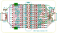
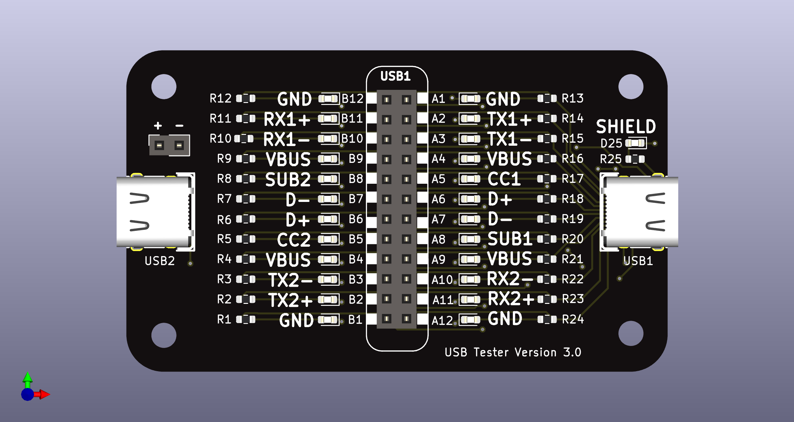

This is a work in progress.

It's a nice simple USB cable tester - you can watch a background video on it [here](https://www.youtube.com/watch?v=qdNnukfTZgA).

The above video covers versions 1 and 2. The current version is 3.

