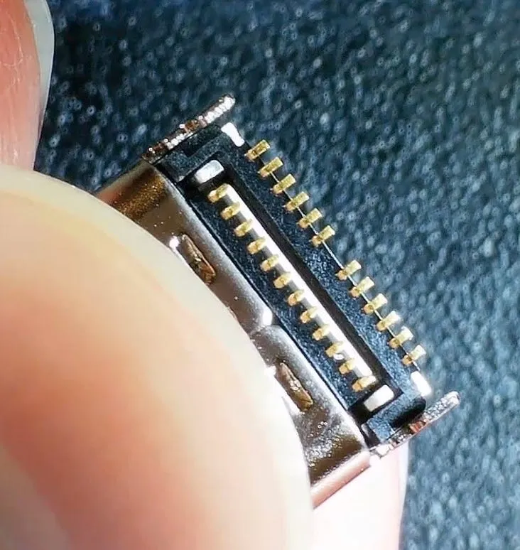
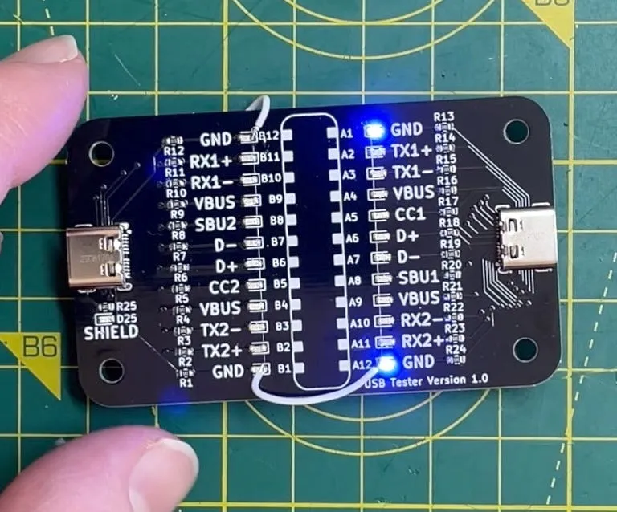
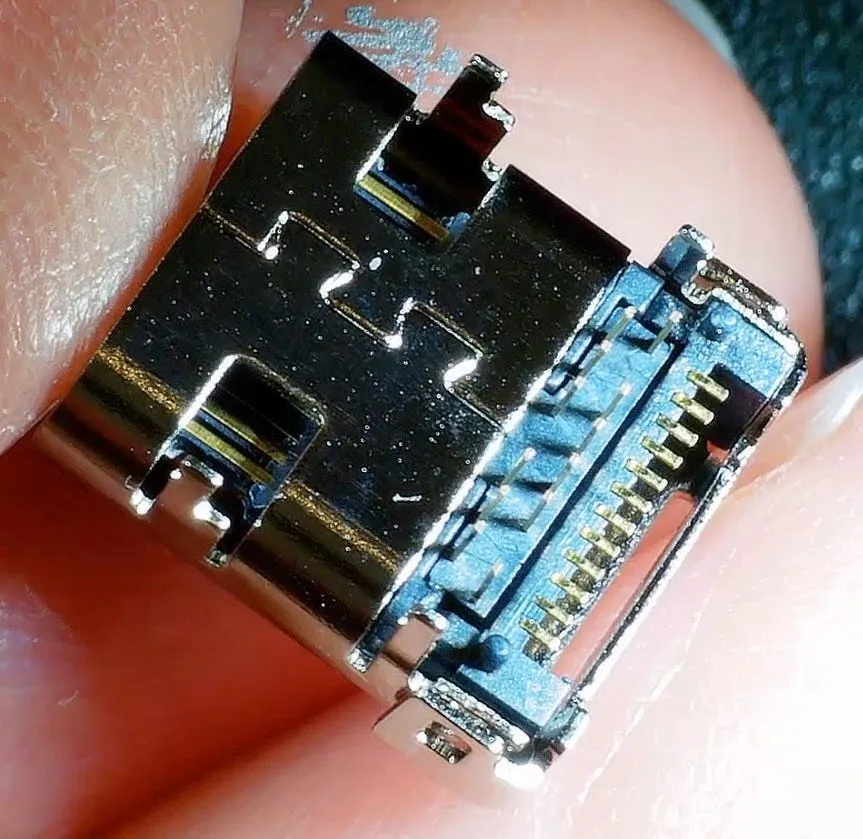
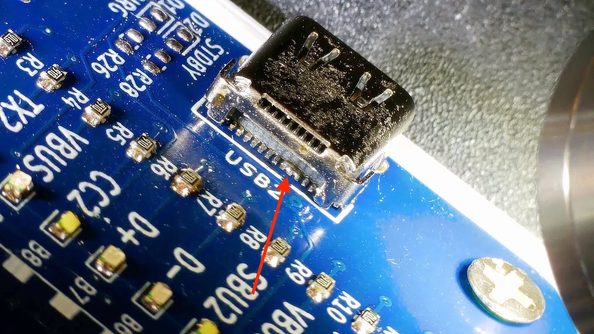
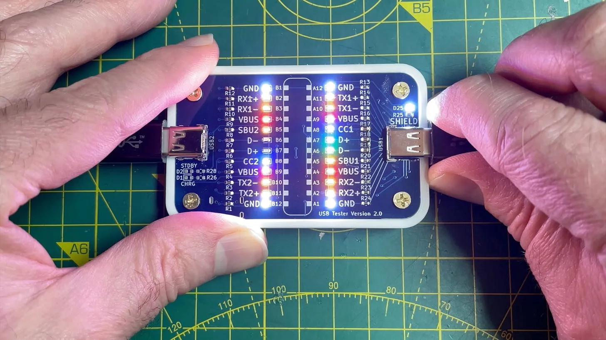
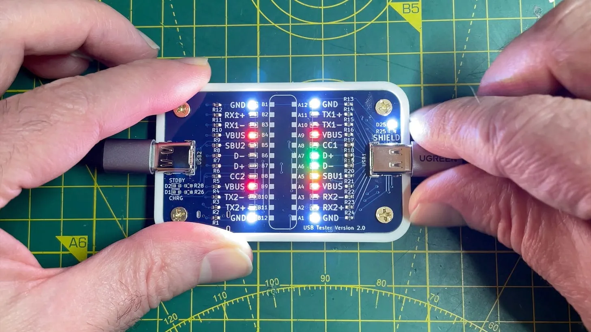
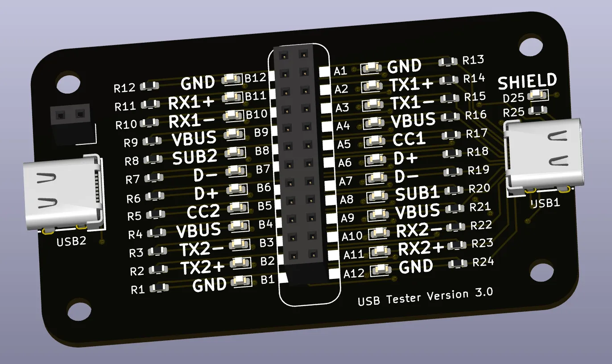

This is a work in progress.

It's a nice simple USB cable tester - you can watch a background video on it [here](https://www.youtube.com/watch?v=qdNnukfTZgA).

The above video covers versions 1 and 2. The current version is 3.

The BOM is pretty straight forward, 100 ohm resistors and whatever color LEDs you would like to use.

The USB sockets are these ones: https://www.lcsc.com/product-detail/USB%20Connectors_XUNPU-TYPEC-324-BCP24_C2835314.html

# The Story So Far

For the first version I used these USB sockets.

These break out all the pins - but unfortunately half the pins are hidden under the socket so you can’t see if you have solder bridges or bad connections. That coupled with a couple of design errors made the first version of the board a bit of a failure.

So for version 2 I opted to use these sockets:

These are a lot easier to inspect. Half the pins a through hole and the other half are visible at the back of the socket.

It is still pretty hard to solder up and not get any bridges, but at least now we can see them easily.

Version 2 works pretty well, we can test various cables - for example here’s a good quality cable that should be able to for 40Gbps.

And here’s a cable that is ok for normal USB - but it’s not going to set the world on fire when it comes to speed.

I’ve got a new version under construction. With the previous two versions it’s been really hard to tell if the sockets are soldered on properly. So I’ve now broken out all the connections and can easily build a test jig to check for shorts.

